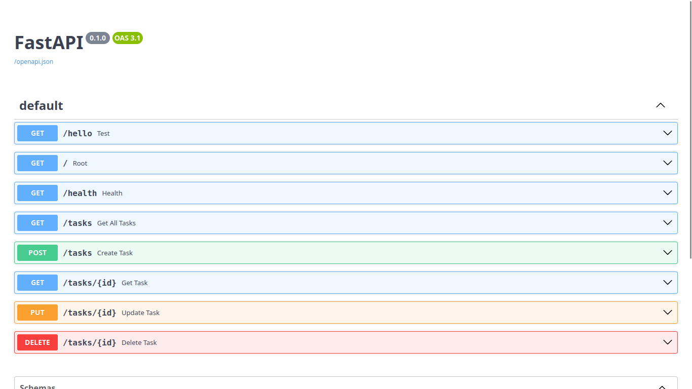
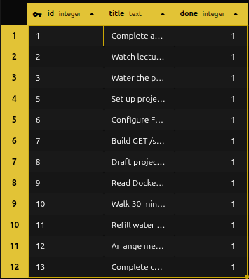
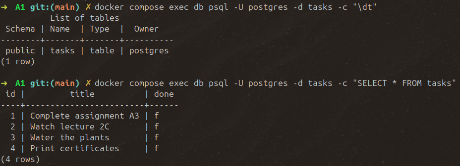

# Task API

A simple RESTful API for managing a to-do list, built with FastAPI.

## Install & Run

```bash
pip install fastapi uvicorn
uvicorn main:app --reload
```

## Endpoints

| Method | Path         | Description                              | Success | Errors        |
|--------|--------------|-------------------------------------------|---------|----------------|
| GET    | `/`          | Get API info                            | 200     | –              |
| GET    | `/health`     | Health check                            | 200     | –              |
| GET    | `/tasks`     | List all tasks                            | 200     | –              |
| GET    | `/tasks?done=true`    | Filter tasks by done status                | 200     | –              |
| GET    | `/tasks?search=milk`  | Search tasks by a term in title  | 200     | –              |
| GET    | `/tasks/{id}`| Get a single task by id                   | 200     | 404            |
| POST   | `/tasks`     | Create a new task                         | 201     | 400            |
| PUT    | `/tasks/{id}`| Replace a task's title and/or done status | 200     | 400, 404       |
| DELETE | `/tasks/{id}`| Delete a task by id                       | 204     | 404            |
| DELETE | `/tasks/{id}`| Delete a task by id                       | 204     | 404            |
| GET    | `/stats`              | Return counts of total, done, open           | 200     | –              |
| POST   | `/reset`              | Restore the 3 seed tasks                   | 200     | –              |


## Example request

```bash
curl -i -X POST http://127.0.0.1:8000/tasks \
  -H "Content-Type: application/json" \
  -d '{"title": "Buy milk"}'
```

## Mortality experiment
Restarting the server means running the server from the start, which is why all previous tasks stored are not persisted. The current implementation uses Python's `list` which is a variable in memory that exists only when the program is running.

## Swagger-UI


## AI vs me

### My prompt

Build a REST API for a simple task manager using Python and FastAPI, with data stored in memory (a Python list, no database). Include automatic interactive API docs via Swagger UI (FastAPI gives this for free at `/docs`).
Define a Task object with attributes: `id` (integer), `title` (string), `done` (boolean, defaults to false).
Seed the in-memory store with 3 example tasks on startup.
The API should consist of the following endpoints:

1. GET /tasks -> return all tasks. 
2. GET /tasks/{id} -> return a single task by id. Return 404 with a JSON error body in the format { "error": "Task 99 not found" } if the id doesn't exist.
3.  POST /tasks -> create a task from a JSON body containing `title`. Assign the next available id automatically, set `done` to false, add it to the list, and return the created task with status 201. If `title` is missing or blank/whitespace-only, return 400 with a JSON error body explaining whether title is missing or empty.
4. PUT /tasks -> update a task's `title` and/or `done` from a JSON body. Both fields are optional but at least one must be provided. Return the updated task. Return 404 if the id doesn't exist. Return 400 if the body is empty/has neither field, or if `title` is provided but blank.
5. DELETE /tasks -> remove a task by id. Return 404 if the id doesn't exist. Return 204 (no body) on success.

Give each endpoint a one-line description so it shows up nicely in Swagger UI. Keep the code in a single `main.py` file, runnable with `uvicorn main:app --reload`. Follow best coding practice and avoid unnecessary code repetition.

##### What the AI did better

- Centralized error formatting: a single @app.exception_handler(HTTPException) converts every HTTPException into {"error": "<message>"}, instead of repeating in each route.
- Split TaskCreate/TaskUpdate models instead of one shared DTO, makes the accepted fields for POST vs. PUT self-documenting in Swagger.
- ID generation defined in a _next_task_id() helper rather than direct global variable manipulation.

The AI implementation follows a clear structure to understand it well enough to explain: seed -> route -> Pydantic validates shape -> manual checks -> helper does lookup/id-assignment -> exception handler normalizes any error before it reaches the client.

##### What it got wrong or quietly ignored

It didn't fully follow its own naming-repetition instruction. My prompt named two specific things to factor out: "looking up a task by id" and "validating a title." It did factor out task lookup (`_get_task_or_404`), but title validation, the "missing" check and the "blank" check, is written out inline, separately, in both `create_task` and `update_task`, instead of behind one shared helper.

##### What my prompt forgot to specify, and what the AI decided for me

- My prompt never mentioned the need of defining Task object as a Pydantic model, as well as the creation of seperate DTOs for each request.
- The 3 seed tasks were never specified, the AI invented generic ones ("Buy groceries"). In addition, the seeding process by the AI follows best practice, and also makes it easy to reset tasks, which was never mentioned

---

## Assignment A2

#### Stage 4: SQLite querying
* **Query Executed:** 
    ```sql
    UPDATE tasks SET done = 1;
    ```
* **Result:** The database modified all rows instantly, and a subsequent `GET /tasks` request to the API immediately returned all tasks with their `done` status updated to true (1), proving both systems read from the exact same live file.

### Stage 5: Database Architecture

#### Why SQLite?
*   **Zero Setup:** It requires no independent server installation or configuration with `Python`. It runs entirely in-process.
*   **Single-File Simplicity:** The entire database is contained within a single file on disk, making it lightweight and highly portable.
*   **Persistence:** Unlike an in-memory array, it natively survives server restarts and crashes, serving as a reliable data store.

#### Database Location & Lifecycle
*   **File Path:** The application connects to `tasks.db` in the project root directory.
*   **Auto-Creation:** If the file does not exist when the application launches, SQLite automatically generates it and applies the initial schema.



#### Run the updated project
- To start FastAPI server and initialize the automatic database connection, run the following command:

```bash
uvicorn main:app --reload
```

## AI vs me

### My prompt
Migrate an existing in-memory simple task manager CRUD API to use SQLite for persistent storage.

Stack: Python, FastAPI, SQLite via the built-in `sqlite3` module.

Database requirements:
- Single table `tasks` with columns: id (integer primary key, autoincrement), title (text, not null), done (integer, default 0)
- Create the table only if it doesn't already exist
- Seed exactly 3 example tasks, but only if the table is currently empty
- All queries must use parameterized placeholders (?)

Current behavior to preserve exactly:
- Five endpoints: GET /tasks, GET /tasks/{id}, POST /tasks, PUT /tasks/{id}, DELETE /tasks/{id}
- POST /tasks: creates from `title`; returns 400 if title is missing or blank/whitespace-only; auto-assigns id; `done` defaults to false; returns 201 with the created task
- PUT /tasks/{id}: title and done are both optional but at least one is required (400 if neither given); 400 if title is provided but blank; 404 if task with the id doesn't exist; returns the updated task
- DELETE /tasks/{id}: 404 if task id doesn't exist; 204 with no body on success
- All errors return JSON in the shape {"error": "<message>"}, not FastAPI's default {"detail": ...}

Runnable via `uvicorn main:app --reload`.

##### What the AI did better
- Correct exception handling: `try/finally` on every connection, which closes even if an exception fires mid-route.
- Reuses a single connection per request (passes conn into fetch_task), whereas my code opens a new connection per helper call.
- Re-fetches the row after insert/update, confirming actual stored state rather than trusting in-memory values.
- Custom `RequestValidationError` for better error handling.

##### What it got wrong or quietly ignored
- No response_model=Task on any route, weaker Swagger docs and no automatic response validation

##### What my prompt forgot to specify, and what the AI decided for me
- It added ORDER BY id unprompted, a reasonable default I hadn't considered.
- Didn't specify file structure → it kept everything in one main.py instead of models.py/database.py split.
- Didn't specify connection-handling strategy → it chose one-connection-per-request, which is a better approach.
- Didn't specify how to build the response after writes → it re-queries the DB.

---
## Assignment A2

### Run it
- To start both the API and a Postgres database (create `tasks` table if it doesn't exist, and seeds three example tasks on first run):

```bash
docker compose up
```

### Environment variables

Copy `.env.example` to `.env` and adjust if needed:
```bash
cp .env.example .env
```
See `.env.example` for the required variables (`DATABASE_URL`, `POSTGRES_PASSWORD`, `POSTGRES_DB`).

### Example request

```bash
curl -i http://127.0.0.1:8000/tasks
```

- Expected response:
```
HTTP/1.1 200 OK
content-type: application/json

[{"id":1,"title":"Complete assignment A1","done":false}, ...]
```

### Data in the database


### Extras

#### Purpose of volumes
when a container is stopped or removed, everything written inside its filesystem is gone with it. A volume lives outside the container's lifecycle, so the database's actual data files persist.

